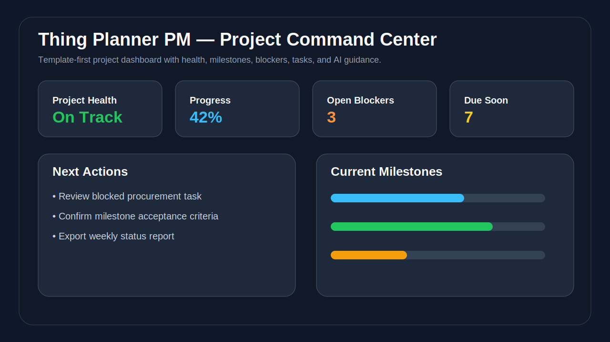
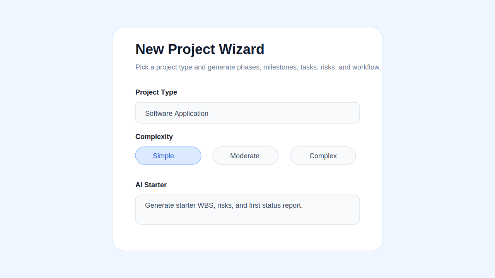
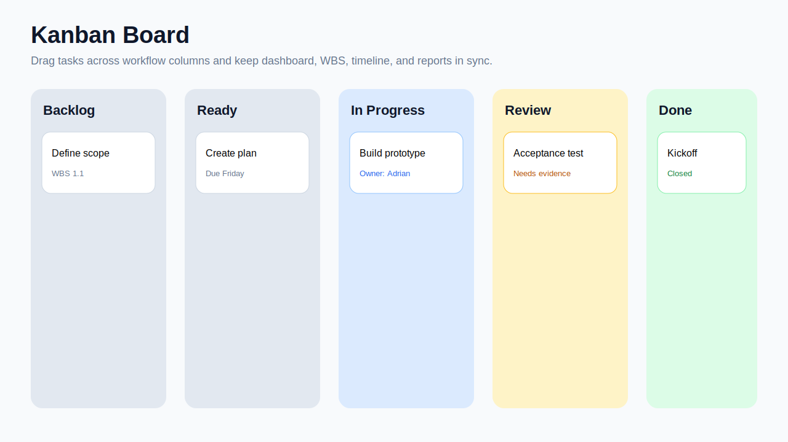
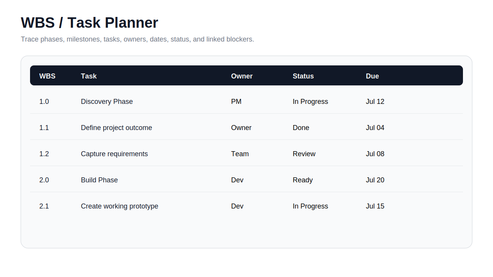

# Thing Planner PM

**Thing Planner PM** is a lightweight, template-first project management web application for planning and tracking real-life projects without the overhead of a heavy enterprise PM suite. It combines a simple project launch wizard, starter templates, Kanban workflow, WBS planning, lightweight timeline tracking, risks/issues/decisions/lessons logs, reporting, and offline-friendly JSON/CSV import-export.

The goal is to make project management approachable for many project types — software, home, auto, office/work, events, document/standards efforts, and other “things” that need structure — while keeping enough detail and traceability to feel like a professional application.

---

## Table of Contents

- [Overview](#overview)
- [Key Features](#key-features)
- [Screenshots](#screenshots)
- [Project Types and Starter Templates](#project-types-and-starter-templates)
- [User Guide](#user-guide)
- [Installation](#installation)
- [Docker Usage](#docker-usage)
- [GitHub Setup](#github-setup)
- [Import and Export](#import-and-export)
- [Data Model](#data-model)
- [Workflow and Traceability](#workflow-and-traceability)
- [AI Planning Assistant](#ai-planning-assistant)
- [Completed Project Archive](#completed-project-archive)
- [Roadmap](#roadmap)
- [Recommended Next Development Steps](#recommended-next-development-steps)
- [Troubleshooting](#troubleshooting)
- [License](#license)

---

## Overview

Thing Planner PM modernizes the structure of a lifecycle project planning spreadsheet into a browser-based project management application. The legacy workbook pattern included project setup, planning, WBS, task monitoring, issue logging, reporting, and hidden calculations. This app turns that into an interactive local web application.

The application is designed around one shared project model. A task appears in the Kanban board, WBS table, timeline, reports, and dashboard, but it is still one underlying record. When the task changes status, all views reflect the change.

### Product positioning

> Start any kind of project in minutes. Get a professional plan, Kanban board, WBS, timeline, issue log, and status report automatically — then reuse completed projects as templates for future work.

### Current version

```text
v0.1.0 - Local static prototype
```

This version runs in the browser with no backend required. It stores data locally in the browser using `localStorage` and supports JSON/CSV export for backup and offline portability.

---

## Key Features

### Project startup

- New Project Wizard
- Project type selection
- Starter templates by project type
- Pre-populated phases, milestones, and minimum tasks
- Suggested starter risks and workflow steps
- Complexity selection concept: simple, moderate, complex
- Project goal and outcome capture

### Project Command Center

- Project health summary
- Percent complete
- Current project status
- Open blockers
- Due-soon work
- Milestone visibility
- AI-style next action guidance
- Activity and traceability overview

### Kanban Board

- Drag-and-drop task workflow
- Default workflow columns:
  - Backlog
  - Ready
  - In Progress
  - Review
  - Blocked
  - Done
- Visual task cards
- Status updates reflected across the application
- Simple workflow designed for both personal and professional projects

### Work Breakdown Structure

- WBS-style task planning
- Phase, milestone, task, and subtask structure
- WBS IDs such as `1.0`, `1.1`, `2.3`
- Owner, due date, priority, and status fields
- Traceability from high-level outcome to execution task

### Timeline / Gantt-style view

- Lightweight timeline view
- Phase and task visibility
- Due-date tracking
- Milestone orientation
- Designed to answer: “Are we on track?”

### Risks, Issues, Decisions, and Lessons

- Risk log
- Issue / blocker tracking
- Decision log
- Lessons learned capture
- Change/activity log
- Closeout notes for future reuse

### Import / Export

- Export complete project data to JSON
- Import JSON to continue work offline or on another machine
- Export task list to CSV
- Preserve completed projects for future reference

### Completed Project Archive

- Save completed projects
- Capture success notes and lessons learned
- Reuse completed projects as future starting points
- Build a practical knowledge base over time

### Local-first operation

- Runs as a static web app
- No required cloud service
- No required database in v0.1.0
- Can run with Python simple server, VS Code Live Server, or Docker/Nginx
- Good foundation for a future self-hosted Docker app

---

## Screenshots

The `/screenshots` folder contains starter SVG mockups. Replace or add real screenshots as the app matures.

### Project Command Center



### New Project Wizard



### Kanban Board



### WBS / Task Planner



### Suggested future screenshots

Add these images later when the app has matured:

```text
screenshots/timeline-view.png
screenshots/risk-log.png
screenshots/export-import.png
screenshots/completed-project-archive.png
screenshots/mobile-view.png
```

---

## Project Types and Starter Templates

Thing Planner PM starts by asking what kind of project the user is planning. From that answer, it can pre-populate phases, milestones, minimum tasks, and starter risks.

### Software Application

Recommended phases:

1. Discovery
2. Requirements
3. UX / UI Design
4. Build
5. Test
6. Release
7. Support / Maintenance

Example starter tasks:

- Define product outcome
- Identify users and roles
- Capture MVP requirements
- Build data model
- Create UI prototype
- Implement core workflow
- Test critical user paths
- Prepare release notes

### Home Project

Recommended phases:

1. Scope
2. Budget
3. Materials
4. Contractor / DIY Planning
5. Execution
6. Inspection
7. Closeout

Example starter tasks:

- Define project outcome
- Estimate budget
- Identify required tools/materials
- Capture measurements
- Schedule work windows
- Track receipts
- Document before/after photos

### Auto Project

Recommended phases:

1. Diagnosis
2. Parts
3. Tools
4. Repair Plan
5. Work Execution
6. Test Drive / Validation
7. Maintenance Record

Example starter tasks:

- Capture symptoms
- Research repair procedure
- Identify parts
- Order supplies
- Perform repair
- Validate fix
- Save notes for future service

### Office / Work Project

Recommended phases:

1. Intake
2. Planning
3. Coordination
4. Execution
5. Reporting
6. Closeout

Example starter tasks:

- Define sponsor outcome
- Identify stakeholders
- Create task plan
- Track decisions
- Prepare weekly status
- Capture lessons learned

### Document / Standards Project

Recommended phases:

1. Draft
2. Internal Review
3. External Review
4. Comment Adjudication
5. Approval
6. Publication
7. Maintenance

Example starter tasks:

- Define document scope
- Create outline
- Draft sections
- Assign reviewers
- Track comments
- Resolve adjudication items
- Publish final version

### Event Project

Recommended phases:

1. Concept
2. Venue / Platform
3. Vendors / Materials
4. Agenda
5. Guests / Participants
6. Execution
7. After Action

Example starter tasks:

- Define event objective
- Confirm date and location
- Build agenda
- Track attendee list
- Prepare materials
- Execute event
- Capture feedback

---

## User Guide

### 1. Start the app

Run the application locally using one of the installation methods below, then open the app in your browser.

Default local URL:

```text
http://localhost:8088
```

### 2. Create a project

Use the New Project Wizard to create a starter plan.

Recommended inputs:

- Project name
- Project type
- Goal / outcome
- Start date
- Target finish date
- Complexity level
- Primary owner

The app will create a starter structure with phases, milestones, tasks, and default workflow states.

### 3. Review the Command Center

Use the Command Center to understand the project at a glance:

- Overall health
- Percent complete
- Due-soon work
- Blockers
- Current phase or milestone
- AI-style recommended next actions

### 4. Manage work in the Kanban Board

Use the Kanban board for daily execution.

Drag task cards between workflow columns:

```text
Backlog → Ready → In Progress → Review → Blocked → Done
```

Recommended usage:

- Move work to `Ready` when it is actionable.
- Move work to `In Progress` when someone starts it.
- Move work to `Review` when it needs validation.
- Move work to `Blocked` when waiting on something.
- Move work to `Done` only when it is complete and verified.

### 5. Manage details in the WBS planner

Use the WBS / task planner when you need more structure.

Typical use cases:

- Add or edit tasks
- Adjust due dates
- Assign owners
- Organize work by phase
- Track completion status
- Build a professional project structure

### 6. Use risks, issues, decisions, and lessons

Use logs to preserve project traceability:

- **Risks**: something that may happen
- **Issues**: something that is already happening
- **Decisions**: important choices made during the project
- **Lessons**: things to reuse or avoid next time

This is especially useful for professional projects, recurring home/auto projects, and future AI-assisted planning.

### 7. Export your project

Use JSON export to create a full backup of the project.

Use CSV export when you want to review tasks in Excel, Google Sheets, or another spreadsheet tool.

### 8. Import a project

Use JSON import to reload a prior project or continue work on another machine.

Recommended practice:

```text
Export JSON at the end of each major project milestone.
```

### 9. Close a project

When the project is complete:

- Mark remaining tasks done or cancelled
- Capture lessons learned
- Save completion notes
- Archive the project
- Reuse the completed project later as a template

---

## Installation

Thing Planner PM is currently a static web application. It does not require Node, Python dependencies, a database, or a backend API for v0.1.0.

### Option 1: Run with Python on Windows PowerShell

From your project folder:

```powershell
cd C:\docker\thing-planner-pm
py -m http.server 8088
```

Open:

```text
http://localhost:8088
```

### Option 2: Run with Python on Mac/Linux

```bash
cd thing-planner-pm
python3 -m http.server 8088
```

Open:

```text
http://localhost:8088
```

### Option 3: Run with VS Code Live Server

1. Open the folder in VS Code.
2. Install the Live Server extension.
3. Right-click `index.html`.
4. Select **Open with Live Server**.

### Option 4: Run as a static website

Any static web server can host this app:

- Nginx
- Caddy
- Apache
- Synology Web Station
- GitHub Pages
- Local Python server

---

## Docker Usage

This app is not Docker-only, but Docker support is included so it can run like your other local tools.

### Build and run with Docker Compose

```powershell
cd C:\docker\thing-planner-pm
docker compose up --build -d
```

Open:

```text
http://localhost:8088
```

### Stop the container

```powershell
docker compose down
```

### Rebuild after changes

```powershell
docker compose up --build -d
```

### Run with Docker only

```powershell
docker build -t thing-planner-pm .
docker run --name thing-planner-pm -p 8088:80 -d thing-planner-pm
```

### Docker files included

```text
Dockerfile
docker-compose.yml
```

The Docker image uses Nginx to serve the static files from the container.

---

## GitHub Setup

Recommended repository:

```text
https://github.com/echofoxx/thing-planner-pm
```

Recommended description:

```text
Template-first project management web app with Kanban, WBS, workflow traceability, starter templates, reporting, and offline JSON/CSV import-export.
```

Recommended topics:

```text
project-management, kanban, wbs, planning, offline-first, productivity, javascript, template-driven, ai-planning, docker
```

### Initial commit

```powershell
cd C:\docker\thing-planner-pm
git init
git add .
git commit -m "Initial Thing Planner PM prototype"
git branch -M main
git remote add origin https://github.com/echofoxx/thing-planner-pm.git
git push -u origin main
```

### If the remote already exists

```powershell
git remote -v
```

If `origin` already points to the correct repo, do not add it again.

### If GitHub has a README conflict

Keep the local comprehensive README:

```powershell
git checkout --ours README.md
git add README.md
git commit -m "Resolve README conflict with comprehensive project documentation"
git push -u origin main
```

### If your local branch is behind the remote

```powershell
git pull origin main --allow-unrelated-histories
```

Resolve any conflicts, then:

```powershell
git add .
git commit -m "Merge remote repository with local Thing Planner PM prototype"
git push -u origin main
```

---

## Import and Export

### JSON export

Use JSON export for full project backup and portability.

Recommended file naming:

```text
thing-planner-project-name-YYYY-MM-DD.json
```

JSON should preserve:

- Project metadata
- Phases
- Milestones
- Tasks
- Risks
- Issues
- Decisions
- Lessons
- Completed project archive data
- Activity log

### JSON import

Use JSON import to reload a previous project or move work between devices.

Recommended validation rules for future versions:

- Confirm schema version
- Validate required project fields
- Check for duplicate task IDs
- Confirm workflow statuses
- Warn before replacing active local data

### CSV export

Use CSV export for task review in Excel or Google Sheets.

Recommended columns:

```text
WBS ID, Phase, Milestone, Task, Owner, Status, Priority, Start Date, Due Date, Actual Finish, Blocked, Notes
```

### Future CSV import

Future CSV import should support mapping columns from spreadsheets into the app’s data model.

---

## Data Model

The app uses a single shared project data model across all views.

```text
Project
├── Metadata
│   ├── Name
│   ├── Type
│   ├── Goal
│   ├── Owner
│   ├── Start Date
│   └── Target Finish Date
├── Team Members
├── Phases
│   └── Milestones
├── Tasks
│   ├── WBS ID
│   ├── Title
│   ├── Description
│   ├── Owner
│   ├── Status
│   ├── Priority
│   ├── Start Date
│   ├── Due Date
│   ├── Actual Start
│   ├── Actual Finish
│   ├── Dependencies
│   ├── Evidence
│   └── Comments
├── Risks
├── Issues
├── Decisions
├── Lessons Learned
└── Activity Log
```

---

## Workflow and Traceability

A professional project app should make changes visible and traceable.

Recommended workflow behavior:

| User action | System behavior |
|---|---|
| Move task to In Progress | Set actual start date if empty |
| Move task to Review | Prompt for acceptance criteria or evidence |
| Move task to Blocked | Prompt for blocker reason |
| Move task to Done | Set actual finish date and update progress |
| Add issue | Link issue to task, phase, or milestone |
| Close project | Capture final notes and lessons learned |

Future versions should add a formal audit trail:

```text
Who changed what, when, from what value, to what value, and why.
```

---

## AI Planning Assistant

v0.1.0 includes a local rule-based AI-style assistant concept. Future versions should support optional local AI through Ollama and optional hosted AI provider configuration.

### Recommended AI capabilities

- Scope interview assistant
- AI-generated starter WBS
- AI-generated milestones
- AI-generated risks and assumptions
- AI-generated status reports
- AI project closeout assistant
- Similar-project recall from completed archives
- Lessons learned extraction
- Template improvement recommendations

### Recommended local AI direction

For local/self-hosted use:

```text
Ollama + local model + optional embedding store
```

Potential future components:

- Ollama for local LLM responses
- SQLite/Postgres for project data
- Qdrant or SQLite vector extension for similar-project recall
- FastAPI or Node backend for AI orchestration

---

## Completed Project Archive

Completed projects should become reusable knowledge.

When a project is closed, capture:

- Final status
- Success rating
- Actual duration
- Estimated vs actual effort
- What worked
- What did not work
- What should be reused
- What should be avoided
- Final risks/issues
- Final deliverables or evidence

Future projects can then use completed projects to:

- Pre-populate better tasks
- Improve estimates
- Suggest risks
- Recommend checklists
- Reuse lessons learned

---

## Roadmap

### v0.1.0 — Local prototype

- Static web app
- Project wizard
- Starter project templates
- Kanban board
- WBS/task planner
- Timeline view
- Risks/issues/decisions/lessons logs
- Local browser save
- JSON export/import
- CSV task export
- Completed project archive concept
- Docker/Nginx static hosting support

### v0.2.0 — Usability and data cleanup

- Editable project metadata
- Improved task editor drawer
- Better filtering and search
- Custom template editor
- Better CSV import/export mapping
- Task dependency field
- Budget and cost fields
- Attachment placeholders
- Screenshot-ready polished UI pass

### v0.3.0 — Professional planning features

- Real Gantt dependency lines
- Baseline vs actual dates
- Milestone health scoring
- Calendar view
- Project status report generator
- Markdown export
- Better issue/risk linkage
- Project change log

### v0.4.0 — Multi-user foundation

- Backend API
- SQLite for simple local persistence
- Postgres option for team use
- User accounts
- Project roles: Owner, Editor, Viewer
- Comments and mentions
- Audit history
- Project-level permissions

### v0.5.0 — AI-assisted planning

- Ollama integration
- AI project scoping interview
- AI WBS generator
- AI risk generator
- AI weekly status writer
- AI closeout assistant
- Completed project similarity search

### v0.6.0 — Reporting and knowledge reuse

- Completed project knowledge base
- Reusable checklists
- Template recommendations
- PDF export
- Project comparison reports
- Success pattern analysis

### v1.0.0 — Production-ready release

- Docker Compose deployment
- Persistent backend database
- Authentication
- Database migrations
- Admin template manager
- Multi-user collaboration
- Robust import/export validation
- AI provider configuration
- Backups and restore
- Release notes and upgrade guide

---

## Recommended Next Development Steps

1. Convert the static prototype to a React + TypeScript app.
2. Add a formal JSON schema for project files.
3. Add task detail drawer editing.
4. Add real drag-and-drop using `dnd-kit`.
5. Add SQLite/Postgres backend persistence.
6. Add Docker Compose with app + API + database.
7. Add AI assistant through Ollama.
8. Add multi-user accounts and permissions.
9. Add completed project similarity search.
10. Add PDF/Markdown reporting.

Recommended future stack:

| Layer | Recommended option |
|---|---|
| Frontend | React + TypeScript |
| UI | Tailwind CSS + daisyUI / shadcn-style components |
| Drag and drop | dnd-kit |
| Backend | FastAPI or Node/Express |
| Local DB | SQLite |
| Team DB | Postgres |
| AI | Ollama local first, optional API provider later |
| Deployment | Docker Compose |
| Auth later | Local accounts, OAuth/Keycloak later |

---

## Troubleshooting

### `cd thing-planner-pm` fails

You may already be inside the project folder.

Check your current path:

```powershell
pwd
```

If you see:

```text
C:\docker\thing-planner-pm
```

Do not run `cd thing-planner-pm` again.

### `remote origin already exists`

The repo already has a GitHub remote configured.

Check it:

```powershell
git remote -v
```

If it points to the correct repo, continue with commit/push commands.

### Push rejected because remote contains work

Pull first:

```powershell
git pull origin main --allow-unrelated-histories
```

Resolve conflicts, then push.

### README merge conflict

Keep the local README:

```powershell
git checkout --ours README.md
git add README.md
git commit -m "Resolve README conflict"
git push -u origin main
```

### Docker port already in use

Change the left side of the port mapping in `docker-compose.yml`:

```yaml
ports:
  - "8090:80"
```

Then open:

```text
http://localhost:8090
```

---

## License

MIT License. See `LICENSE` for details.
